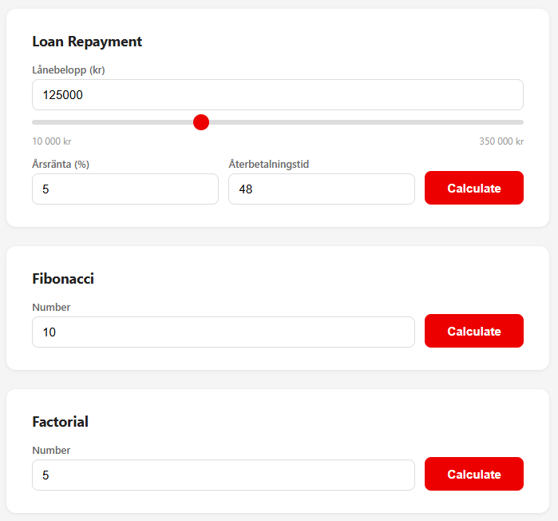
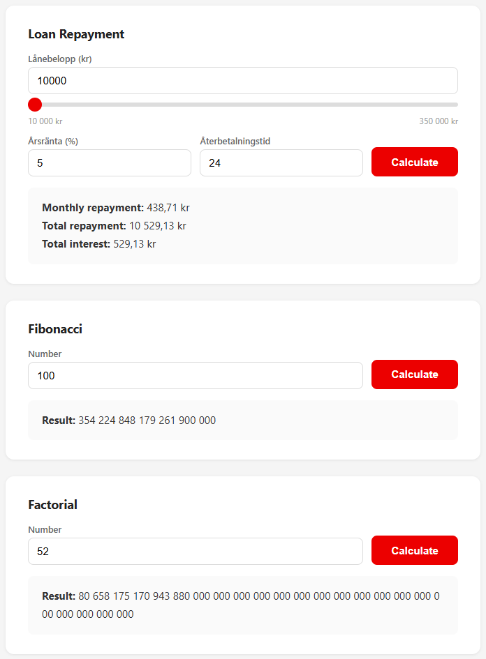
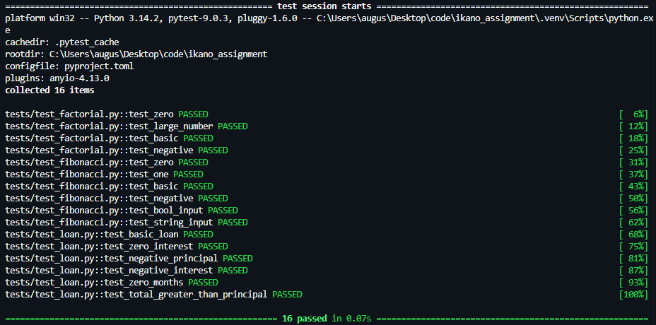

# Ikano - Developer Assignment
A calculation service with Fibonacci, Factorial, and Loan Repayment. Exposed as a REST API with a simple web UI. Built with Python and FastAPI.


### Getting Started
```bash
git clone https://github.com/augustsletto/ikano-assignment.git
cd ikano-assignment
```

### Install dependencies

```bash
# with uv (recommended)
uv sync

# or with pip
pip install -r requirements.txt
```

### Run the server
```bash
uvicorn app.main:app --reload

# or 

uv run fastapi dev
```
Open http://localhost:8000 for the web UI, or http://localhost:8000/docs for the API docs

### Run with docker
```bash
# make sure docker desktop is running
docker compose up --build


```

Open http://localhost:8000/


### API Endpoints
All endpoints accept JSON and return JSON

```bash
# POST /fibonacci

curl -X POST http://localhost:8000/fibonacci \
  -H "Content-Type: application/json" \
  -d '{"fibonacci_integer": 10}'

# Results:  {"result":55}

```
```bash
# POST /factorial

curl -X POST http://localhost:8000/factorial \
  -H "Content-Type: application/json" \
  -d '{"factorial_integer": 5}'

# Results:  {"result":120}

```
```bash
# POST /loan

curl -X POST http://localhost:8000/loan \
  -H "Content-Type: application/json" \
  -d '{"principal": 125000, "annual_rate": 5, "months": 48}'

# Results:  {
#            "monthly_repayment":2878.66,
#            "total_repayment_amount":138175.76,
#            "total_interest_paid":13175.76
#           }

```

### Running Tests
```bash
python -m pytest tests/ -v

# or

uv run python -m pytest tests/ -v
```

## Project Structure
```
├── app/
│   ├── calculations/
│   │   ├── fibonacci.py           # Fibonacci calculation (iterative)
│   │   ├── factorial.py           # Factorial calculation
│   │   └── loan_repayment.py      # Loan repayment (Decimal-safe)
│   ├── templates/
│   │   └── index.html             # Web UI
│   ├── schemas.py                 # Pydantic request/response models
│   └── main.py                    # FastAPI application and routes
├── tests/
│   ├── test_fibonacci.py
│   ├── test_factorial.py
│   └── test_loan.py
├── Dockerfile
├── compose.yaml
├── requirements.txt
├── pyproject.toml
└── README.md
```

## Design Decisions

- Business logic is separated from the API layer. Each calculation lives in its own module with no HTTP dependencies, making them independently testable.
- Loan calculations use Python's `Decimal` module via `Decimal(str(...))` to avoid floating-point precision issues. Rounding uses `ROUND_HALF_UP` at the output boundary.
- Fibonacci uses an iterative approach, O(n) time, O(1) space, instead of recursion.
- Pydantic handles type validation at the API boundary. The functions themselves also validate inputs and raise `ValueError`, so they work correctly when called outside the API.

## Assumptions and Limitations

- The loan formula assumes fixed monthly payments (annuity method) with no fees.
- No authentication or rate limiting is implemented.
- The web UI calls the same REST endpoints via fetch, it's not a separate frontend application.
- Very large factorial inputs will return correct results (Up to a certain point) but may be slow and produce very large numbers.

### Screenshots

**Web UI** - a single-page calculator styled after Ikano Bank's design, with a slider for loan amounts and Swedish number formatting.



**Calculations in action** - loan repayment with Decimal-safe rounding, Fibonacci for large sequences, and factorial handling big numbers gracefully.



**Test suite** - 16 tests covering normal cases, edge cases, and invalid inputs across all three calculations.

